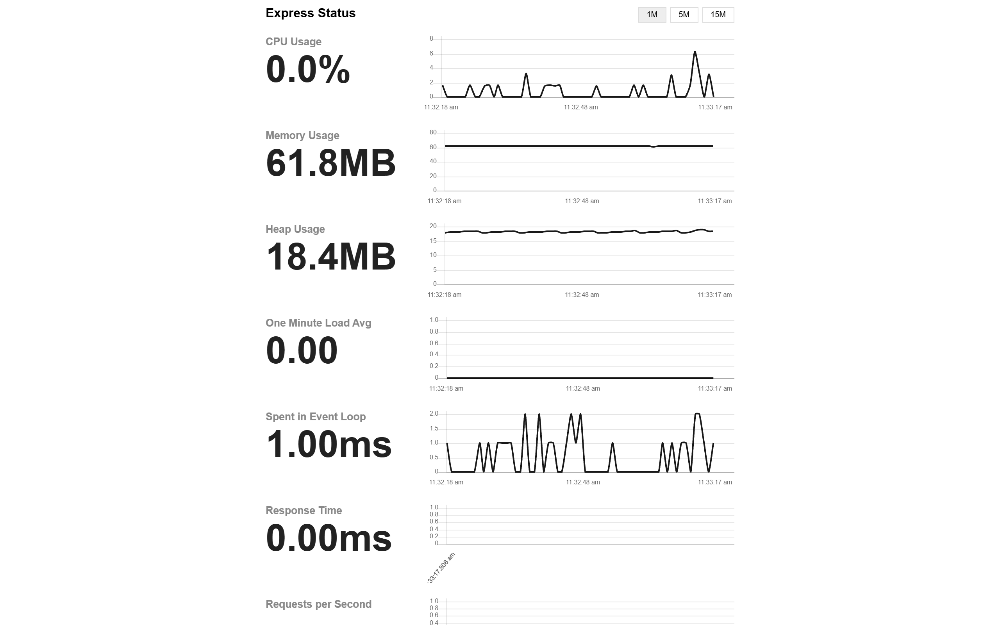

# 🎓 CertChain — Blockchain Certificate Issuance & Verification dApp

A full-stack decentralized application built on **Stellar Soroban** that allows institutions to issue tamper-proof certificates on-chain and lets anyone verify them without needing a wallet.

![Dashboard]

### 🌐 Live Application
🌍 **[Access the Live CertChain App on Vercel](https://cert-chain-a8e7.vercel.app/)**

### 🎥 Live Video Demo
▶️ [Watch the full CertChain dApp Demo on Loom](https://www.loom.com/share/e91247c07fcb47348ba4b8ac09a8f8d1)

---

### 📊 Live Metrics Dashboard


*(Please save your dashboard screenshot as `metrics-screenshot.png` in the root folder so it appears here!)*

### 📈 Active Server Monitoring


*(Please save your `/status` monitoring screenshot as `monitoring-screenshot.png` in the root folder so it appears here!)*

---

## 🔗 Smart Contract Info

| Field | Value |
|---|---|
| **Network** | Stellar Testnet |
| **Contract ID** | `CCLKKIKK63UT6TJV327NHZGK62ERZVNE6RN2DL6BPZMHCL5SMGTOATU2` |
| **WASM File** | `contracts/target/wasm32v1-none/release/cert_contract.wasm` |
| **Soroban SDK** | `v25` |
| **Deployed On** | 2026-04-10 |
| **Explorer** | [View on Stellar Expert](https://stellar.expert/explorer/testnet/contract/CCLKKIKK63UT6TJV327NHZGK62ERZVNE6RN2DL6BPZMHCL5SMGTOATU2) |

> ⚠️ **Testnet only** — Not for production use yet.

---

## 🏗️ Architecture

```
cert-chain/                  ← React Frontend (Vite)
├── src/
│   ├── components/          ← UI Components (IssueCert, VerifyCert, etc.)
│   ├── hooks/
│   │   ├── useStellar.js    ← Soroban contract interaction (issue/verify)
│   │   ├── useWallet.js     ← Freighter wallet integration
│   │   └── useToast.js      ← Toast notifications
│   └── utils/
│       └── constants.js     ← CONTRACT_ID, CERT_TYPES, mock data
│
cert-chain-backend/          ← Node.js Express Backend
├── index.js                 ← Email API via Brevo HTTP
├── cert_contract.rs         ← Rust contract source (reference copy)
└── .env                     ← BREVO_API_KEY
│
contracts/                   ← Soroban Rust Smart Contract
└── contracts/cert_contract/
    └── src/
        ├── lib.rs           ← Main contract logic
        └── test.rs          ← Contract unit tests
```

---

## 📜 Smart Contract Functions

### `issue_cert(env, issuer, cert_hash, student_email, course, date)`
- Issues a certificate and stores it on-chain using `cert_hash` as the key
- Requires **issuer wallet auth** (Freighter)
- Panics if the same hash already exists (duplicate prevention)

### `verify_cert(env, cert_hash) → CertInfo`
- Looks up a certificate by its hash
- Returns `{ issuer, student_email, course, date, valid }` 
- No wallet required — public read

### `CertInfo` Struct
```rust
pub struct CertInfo {
    pub issuer: Address,
    pub student_email: String,
    pub course: String,
    pub date: String,
    pub valid: bool,
}
```

---

## 🚀 Getting Started

### Prerequisites
- Node.js `v18+`
- Freighter browser extension (for issuing certs)
- Stellar account with Testnet XLM ([Friendbot](https://friendbot.stellar.org/))
- Rust + `stellar-cli` (for contract re-deployment only)

### Frontend Setup
```bash
cd cert-chain
npm install
npm start
# Runs at http://localhost:3000
```

### Backend Setup
```bash
cd cert-chain-backend
# Create .env file:
# BREVO_API_KEY=your_brevo_api_key_here
npm install
node index.js
# Runs at http://localhost:5000
```

---

## ✉️ Email Flow

When a certificate is issued:
1. Soroban contract stores the cert on-chain
2. Frontend calls `POST /send-email` on the backend
3. Backend sends a styled HTML email via **Brevo API** with:
   - Student name, course, issuer
   - **Certificate hash** (to verify later)

> **💡 Terminal Logs:** You can monitor the real-time email sending status directly in the backend terminal, which logs successful email deliveries and any errors.

---

## 🌟 Example: Successful Issuance

When a certificate is successfully issued and verified, you get a verifiable transaction hash and an automated email confirmation:

**1. Transaction Hash (On-Chain Record):**
```text
TX: KI8YBE7ZX56WNDZMZHNPIVECX4JLUMY9...
```

**2. Backend Email Log:**
```text
✅ Email sent to shindeakanksha069@gmail.com | ID: <202603261532.75669541366@smtp-relay.mailin.fr>
```

**3. Verified Certificate View:**


*(Note: Save your uploaded certificate screenshot as `certificate.png` in the project folder to display it here).*

---

## 🔄 Contract Rebuild & Redeploy

```bash
cd cert-chain/contracts

# Build
stellar contract build

# Deploy to testnet (needs 'alice' identity configured)
stellar contract deploy \
  --wasm target/wasm32v1-none/release/cert_contract.wasm \
  --source alice \
  --network testnet
```
Update the new Contract ID in `src/utils/constants.js` → `CONTRACT_ID`.

---

## 🛠️ Tech Stack

| Layer | Technology |
|---|---|
| Smart Contract | Rust + Soroban SDK v25 |
| Blockchain | Stellar Testnet |
| Wallet | Freighter Extension |
| Frontend | React + Vite |
| Backend | Node.js + Express |
| Email | Brevo HTTP API |
| Stellar RPC | `https://soroban-testnet.stellar.org` |

---

## 🧪 Running Contract Tests

```bash
cd cert-chain/contracts
cargo test
```

---

## 📁 Key Files

| File | Purpose |
|---|---|
| `src/utils/constants.js` | Contract ID & cert type constants |
| `src/hooks/useStellar.js` | Issue & verify cert via Soroban |
| `src/hooks/useWallet.js` | Freighter wallet connect/sign |
| `cert-chain-backend/index.js` | Email sending API |
| `cert-chain-backend/cert_contract.rs` | Rust contract source (reference) |
| `contracts/contracts/cert_contract/src/lib.rs` | Live Rust contract |

---

## 📝 User Data & Feedback

We actively collect user feedback and maintain logs of interactions to improve the CertChain dApp experience. You can view the live feedback and user tracking records here:
📊 **[View Feedback & User Data Spreadsheet](https://docs.google.com/spreadsheets/d/11lRZnMSYqBdyf9SdbClaOYM3DPJ1uuBs7XtXbTbc46k/edit?usp=sharing)**

---

## 👨‍💻 Author

Built as a Level 5 project — Shubham
